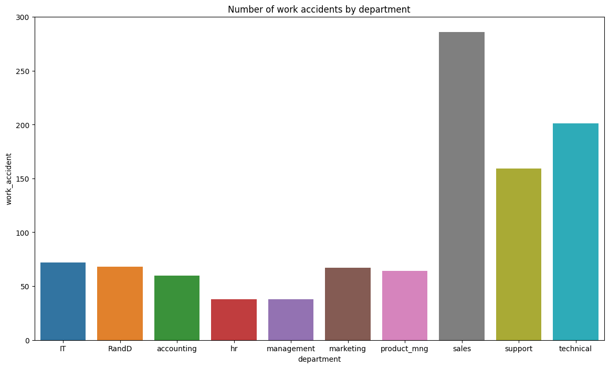
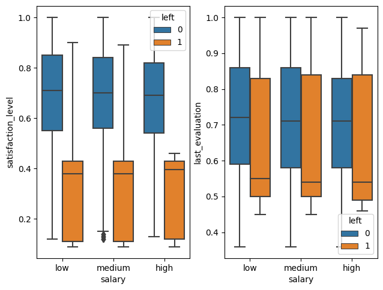
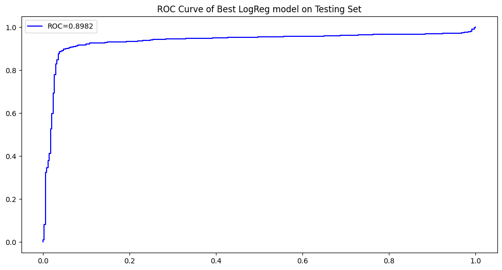
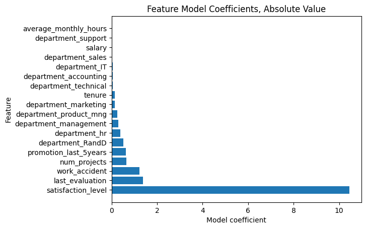

# Google Advanced Data Analytics Capstone - A predictive model to identify at-risk employees using HR Data 📊 
Welcome to my Capstone Project for the Google Advanced Data Analytics Certificate offered through Coursera. As a culminating task, this project served as an encapsulation of all the skills and concepts taught throughout the course, all consolidated into one project, with the aim of applying those skills in a real-world scenario.

## The premise 💡
So here's the situation: we, as a data professional, have been approached by a fictitious company named Salifort Motors, and asked to help their HR department, who wants to improve employee satisfaction levels. To this end, you decide to build a classifier that aims to predict whether or not an employee is likely to leave the company. The idea behind this is twofold; in doing so, HR may be able to identify the factors that influence an employee to stay/leave. They will also save valuable time, resources and money that was used to recruit, hire, and onboard these employees by getting them to stay.

## Dataset obtention \& cleaning 📂
HR has provided us with an employee dataset consisting of 15000 rows of data. I made use of the Pandas library to import, observe, and clean the dataset. This included renaming columns to maintain consistency and ease-of-understanding, checking for missing values, and checking for and removing duplicate entries, as well as values that were considered outliers. This process ensures that the dataset is free of any data that could potentially negatively affect our analysis and distort the results.

## Exploratory Data Analysis 🔍
After the dataset was cleaned up, I conducted Exploratory Data Analysis, to get a feel for the data and get a sense of what I was working with. During stage, I was mainly concerned with uncovering the distribution of certain variables across several categories. This could be an important indicator of potential relationships among variables. For example, the following plot shows that there were significantly more work accidents in the Sales department than any other department within the company. 

This could raise questions for later analysis:
- Why is the Sales department more accident prone, even though Sales seems like a relatively "safe" department?
- Should we investigate into how a workplace accident was defined?

Another example is this plot, showing the distribution of employee satisfaction and their last evaluation score based on their salary level.

This plot gives us some insight about employee performance and satisfaction across the three salary bands. Surprisingly enough, employee performance and satisfaction overall was very uniform across different salary levels. However, what is also uniform and consistent is the lower levels of employee satisfaction and performance among those who ended up leaving the company - suggesting that maybe employees that became dissatisfied with the company ended up seeing performance suffer as a result. A potential next step would be to inquire about the specifities of these employees' situations, to potentially help uncover the reason as to their dissatisfaction.

## Building the model 🔧
I decided on a Logistic Regression model, since I believed it would prove useful to any external stakeholders to be able to visualize what features were most influential in predicting employee churn. This could be done directly using the model coefficients. To avoid any one feature's numerical scale from "dominating", all numerical features were standardized. Categorical features were encoded to ensure compliance with sci-kit learn's models. The model was then divided into a 75/25 train/test split. 

## Model results 💾
The model overall performed to a respectable degree. Some notworthy results were a 91\% accuracy score, as well as an 89\% AUROC score, as shown by the plot below. . In terms of determining the top features for predicting employee churn, we can refer to the plot below:  The most important feature is by far employee satisfaction. This makes sense, as an employee would be hard-pressed to find a new place of work if they are unsatisfied with their current job. To further leverage this insight, the HR team may take it upon themselves to investigate this matter to a greater extent; they could examine historical employee records to see if there are any telltale signs that the employee was unhappy - lesser pay, extended hours, etc. Lastly, the company as a whole could aim to use this information to improve their operations to reduce the chance of employees leaving in the future.
